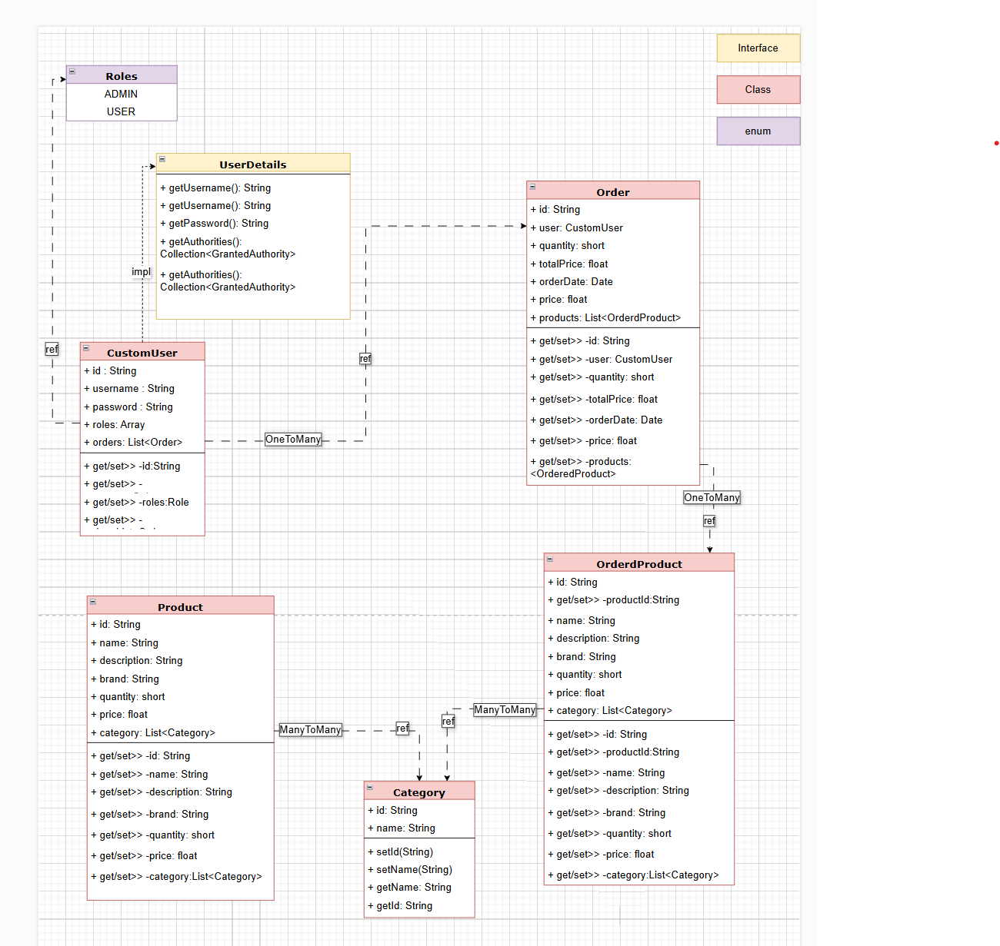

## 1. Introduction
This document provides an overview of the E-Commerce RESTful Web Service project, detailing its functionalities,
API endpoints, required data for each API, and basic information about the system.

---

## 2. Project Objectives

The primary objectives of this project are:

- To develop a RESTful web service for managing e-commerce features.
- Implement end-to-end support for managing Products, Categories, Orders, and Users.
- Ensure secure functionality using Spring Security for authentication and authorization.
- Provide robust CRUD (Create, Read, Update, Delete) operations for key functionalities.

---
### Class Diagram

---


## 3. Functional Features

### 3.1 User Management

- **Endpoint:** `/users`
- **Functions:**
    - Create a new user with password hashing using BCrypt.
    - Retrieve a user by ID or username.
    - List all users.
    - Update a user's details (name, email).
    - Delete a user.

### 3.2 Product Management

- **Endpoint:** `/products`
- **Functions:**
    - Create a new product with fields like name, description, price, and category.
    - Retrieve a product by ID or SKU.
    - List all products.
    - Update a product's details (name, description).
    - Delete a product.

### 3.3 Category Management

- **Endpoint:** `/categories`
- **Functions:**
    - Create a new category with name.
    - Retrieve a category by ID or name.
    - List all categories.
    - Update a category's details (name).
    - Delete a category.

### 3.4 Order Management

- **Endpoint:** `/orders`
- **Functions:**
    - Create an order with userId, productId, quantity, and orderDate.
    - Retrieve an order by ID or userId.
    - List all orders.
    - Update an order's details (status).
    - Delete an order.

### 3.5 Security Features

- **Authentication:** Use Spring Security for user authentication via username/password or token-based methods.
- **Role-Based Access Control (RBAC):** Restrict access to certain actions (e.g., creating products) to users with
  the ADMIN role only.

# User Management API Documentation

This document describes the RESTful APIs provided by the User Module of the e-commerce application.

## Features

1. **User Registration**:
    - Create new user accounts with required fields:  username, password, roles
2. **User Authentication**:
    - Authenticate users using a username/password mechanism
3. **User Deletion**:
    - Permanently delete user accounts
4. **User Update**:
    - Update user information including all relevant fields
5. **Retrieve All Users**:
    - Retrieve a list of all registered users (admin-only access)
6. **Retrieve Single User**:
    - Retrieve detailed information about a specific user by their ID

## API Endpoints

### Registration

Endpoint: `/register`
Method: POST
Description: Registers a new user account with the provided details.

### Authentication

Endpoint: `/login` 
Method: POST
Description: Validates username and password to authenticate a user. Typically handles token generation for API
access.

### Deletion

Endpoint: `/users/{id}`
Method: DELETE
Description: Deletes an individual user account based on their ID.

### Update

Endpoint: `/users/{id}`
Method: PUT
Description: Updates specific fields of a user's record, including id, username, password, roles, etc.

### Retrieve All Users

Endpoint: `/users`
Method: GET
Description: Returns a list of all registered users. Requires valid admin credentials to access.

### Retrieve Single User

Endpoint: `/users/{id}`
Method: GET
Description: Retrieves the details of a specific user based on their ID, ensuring proper security measures are in
place.

## Data Requirements

### Registration (`/register`)

- **Required Fields**:
    - `username`: The username used during registration (string)
    - `password`: Security password for the user account (string)
    - `roles`: Array of roles associated with this user (e.g., USER, ADMIN)

    ```json
     {
        "username": "?",
        "password": "?",
        "roles": ["ADMIN","USER"]
      }
  ```

### Authentication (`/login`)

- **Required Fields**:
    - `username`: The username used during registration (string)
    - `password`: Security password for the user account (string)
    ```json
     {
        "username": "?",
        "password": "?"
      }
  ```

### Deletion (`/users/{id}`)

- **Required Field**:
    - `id`: Unique identifier of the user to be deleted

### Update (`/users/{id}`)

- **Required Fields**:
    - `id`: User ID whose details are being updated
    - All fields that can be changed: username, password, roles, orders (if applicable)
   ```json
    {
        "username": "?",
        "password": "?",
        "roles": ["ADMIN","USER"]
    }
  ```

### Retrieve All Users (`/users`)

- **Output Format**: Typically a JSON array containing objects with user details.

### Retrieve Single User (`/users/{id}`)

- **Required Field**:
    - `id`: User ID of the account to be retrieved
- **Description**: This endpoint performs security checks before retrieving sensitive data. The actual sensitive
  information may need to be excluded from the response.

# Product Management API's

## Features

1. **Product Registration**:

- Create new user product with required fields: name, description, brand, category, price, available quantity

2. **Product Deletion**:

- Permanently delete Product  (admin-only access)

3. **Product Update**:

- Update user information including all relevant fields  (admin-only access)

4. **Retrieve All Products**:

- Retrieve a list of all registered product (admin-user access)

5. **Retrieve Single Product**:

- Retrieve detailed information about a specific product by their ID

## API Endpoints

### Registration

Endpoint: `/products`
Method: POST
Description: Registers a new product with the provided details.

### Deletion

Endpoint: `/products/{id}`
Method: DELETE
Description: Deletes an individual Product based on their ID.

### Update

Endpoint: `/products`
Method: PUT
Description: Updates specific fields of a product's record, including username, password, roles, etc.

### Retrieve All Product

Endpoint: `/products`
Method: GET
Description: Returns a list of all registered products.

### Retrieve Single Product

Endpoint: `/products/{id}`
Method: GET
Description: Retrieves the details of a specific product based on their ID, ensuring proper security measures are in
place.

## Data Requirements

### Registration (`/products`)

- **Required Fields**:
    - `name`: Name of product
    - `brand`: Name of product's brand
    - `description`: Extra information related to brand and product
    - `price`: Amount of one product
    - `quantity`: Product stock
    - `category`: List of category associated with this product

      ```json
      {
        "name": "?",
        "brand": "?",
        "description": "?",
        "price": "?",
        "quantity": "?",
        "category": [
          {"name": "?"},
          {"name": "?"}
        ]  
      }
      ```

### Deletion (`/products/{id}`)

- **Required Field**:
    - `id`: Unique identifier of the product to be deleted

### Update (`/products`)

- **Required Fields**:
    - `id`: User ID whose details are being updated
    - All fields that can be changed: username, password, roles, orders (if applicable)
   ```json
     {
        "id": "?",
        "name": "?",
        "brand": "?",
        "description": "?",
        "price": "?",
        "quantity": "?",
        "category": [
          {"name": "?"},
          {"name": "?"}
        ]  
      }
  ```

### Retrieve All Products (`/products`)

- **Output Format**: Typically a JSON array containing objects with user details.

### Retrieve Single Product (`/products/{id}`)

- **Required Field**:
    - `id`: Product ID to be retrieved


  


# Order Management API's

## Features

1. **Order Registration**:

- Create new Order  with required fields: products, orderDate, user  (admin-only access)

2. **Order Deletion**:

- Permanently delete Order  (admin-only access)

3**Retrieve All Order**:

- Retrieve a list of all registered order (User can see their orders)

5. **Retrieve Single Order**:

- Retrieve detailed information about a specific Order by their ID

## API Endpoints

### Registration

Endpoint: `/orders`
Method: POST
Description: Registers a new order with the provided details.

### Deletion

Endpoint: `/orders/{id}`
Method: DELETE
Description: Deletes an individual order based on their ID.

### Retrieve All Order

Endpoint: `/orders`
Method: GET
Description: Returns a list of all registered order.

### Retrieve Single Order

Endpoint: `/orders/{id}`
Method: GET
Description: Retrieves the details of a specific order based on their ID, ensuring proper security measures are in
place.

## Data Requirements

### Post (`/order`)

- **Required Fields**:
  - `products`: Needs to provide list of valid products that contains (id,quantity) 
  - `user`: Valid user id
   ```json
  {
    "products": [
      {"id": "?","quantity": "?"},
      {"id": "?","quantity": "?"}
    ],
    "user": {"id": "?"}
  }
  ```

### Deletion (`/orders/{id}`)

- **Required Field**:
  - `id`: Unique identifier of the order to be deleted

### Retrieve All  (`/orders`)

- **Output Format**: Typically a JSON array containing objects with orders details.

### Retrieve Single Order (`/orders/{id}`)

- **Required Field**:
  - `id`: category ID to be retrieved


